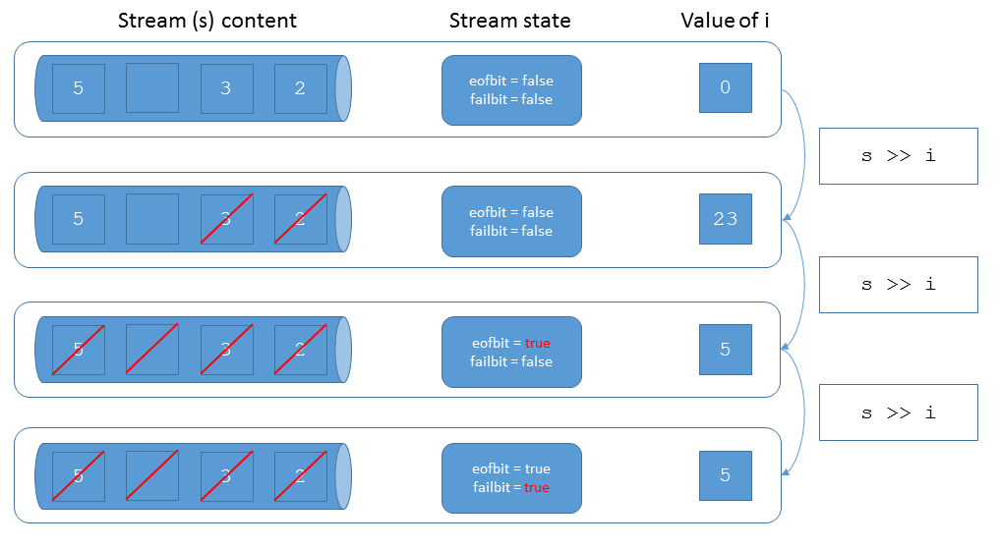

# 0 Catch Up

Chances are high that you haven't been able to solve all exercises from the previous weeks due to the testat. So first complete the remaining non-extra exercises you missed.

# 1 Date with enum for Month and Weekday

The class `Date` from the lecture examples is confusing to use, because we specify day, month and year as numbers. Change the `Date` class from the template to use an `enum` type for month.

* Is it possible to provide the overloads of `Date`'s constructors to allow writing `Date{1, Nov, 2012}` and `Date{Nov, 1, 2012}`? 
* Implement a member function `dayOfWeek()` for your `Date` class that calculates if a given date is `Monday`, `Tuesday` etc. Define a corresponding `enum` type within the `Date` class.
  * Should this be an `enum class` or is an `enum` sufficient? 

*Hint:* Consult [Wikipedia](https://en.wikipedia.org/wiki/Determination_of_the_day_of_the_week) to figure out how to calculate the day of the week with your calendar. Note, that we only support Gregorian dates.

## (Optional) Different Representation

Maybe another internal representation than 3 numbers for day-month-year, like the number of days since the start of your calendar makes it easier to implement this feature. Even though this might require change to other member functions, but your test cases should help you keep those working. Try also to implement this more compact date representation.

# 2 Simulated Switch with Toggle Button

To exercise an enum type with hidden values we implement a class `Switch`. The `Switch` simulates three states: `off`, `on`, `blinking`. It comes with a single button simulated with the member function `pressButton()` that switches from `off` to `on` to `blinking` and then to `off` again. Do not expose the enum values in your `Switch.h` file. 

# 3 Finite Field Modulo 5

In this exercise you have to implement a finite field (galois field/endlicher Koerper). You can take the code of `Ring5` from the lecture as a starting point. Beyond the addition and multiplication a `Ring5` features, you should add the following functionality:

* Provide subtraction as inverse of addition.
  * Can it be mapped directly to integer subtraction?
  * `a - a = 0`
  * `3 - 4 = 4 <=> 4 + 4 = 3`
* Provide unary minus operator for negation
  * `a + (-a) = 0`
* Provide division as inverse of multiplication.
  * First figure out for each `x` (excluding `0`), what `y` provides `1 / x = y -> 1 = x * y`
  * Does it make sense to provide relational operators for `Field5`?

## Simplification with Boost

Remove all operator implementations you can replace with Boost operators.

* If you don't already have it, install it first on your system.
* Have a look at the documentation for [Boost operators](https://www.boost.org/doc/libs/1_71_0/libs/utility/operators.htm)
* Apply Boost operators to your `Field5`
 
# 5 (Optional) Ring Modulo 6

Implement a class `Ring6` that implements modulo arithmetic for unsigned integers modulo `6`.

* Start out with corresponding test cases, before you implement an operation.
* Provide addition and multiplication operators.
* Provide output operator to a stream.
* Provide inward and outward conversion from unsigned integers.
  * When is it useful to make these conversions explicit? 
* Is it useful to implement subtraction for `Ring6`?
* Is it useful/possible to implement division for `Ring6`? 
 
# 6 (Optional) Refresher on Stream States

As a little help to guide you through reading the Word(s) from an input stream you can follow the rule of thumb: "do as the ints do". Below you see a piece of code you can copy into a Cevelop project and run directly.

```cpp
#include <iostream>
#include <sstream>
#include <iterator>
#include <vector>

std::string bool_value(bool b) {
  return (b ? "true" : "false");
}

void printStreamState(std::stringstream const &s) {
  std::cout << "s.eof():  " << bool_value(s.eof()) << "\n";
  std::cout << "s.fail():  " << bool_value(s.fail()) << "\n";
  std::cout << "s.bad():  " << bool_value(s.bad()) << "\n";
  std::cout << "s.good():  " << bool_value(s.good()) << "\n";
  std::cout << "bool(s):  " << bool_value(bool(s)) << "\n";
  std::cout << "-----------------------------------------" << "\n";
}

int main(int argc, char **argv) {
  std::stringstream s { "23 5" };
  printStreamState(s);
  int i { };

  s >> i;
  std::cout << "value after first read: " << i << "\n";
  printStreamState(s);
  s >> i;
  std::cout << "value after second read: " << i << "\n";
  printStreamState(s);
  s >> i;
  std::cout << "value after third read: " << i << "\n";
  printStreamState(s);
}
```

As a result you'll see the contents of the variable i after each read. After the contents of i you see the state of the input stream s. For lazy students here is the program output:

```
s.eof():  false
s.fail():  false
s.bad():  false
s.good():  true
bool(s):  true
-----------------------------------------
value after first read: 23
s.eof():  false
s.fail():  false
s.bad():  false
s.good():  true
bool(s):  true
-----------------------------------------
value after second read: 5
s.eof():  true
s.fail():  false
s.bad():  false
s.good():  false
bool(s):  true
-----------------------------------------
value after third read: 5
s.eof():  true
s.fail():  true
s.bad():  false
s.good():  false
bool(s):  false
-----------------------------------------
```



Details about the stream flags can be found [here](http://en.cppreference.com/w/cpp/io/ios_base/iostate) (with a nicely colored table at the bottom). 

# Self Study Video

Namespaces and ADL: https://skripte.hsr.ch/Informatik/Fachbereich/C++/CPl/Videos/6.%20namespaces%20and%20adl.mp4

# Code Reading Exercise from "cvu - Code Critique 106"

This is a code reading exercise that contains various C++ features you should be familiar with:

* Classes (Week 5)
* Operator Overloading (Week 5/6)
* Enumerations (Week 6)
* I/O with Streams (Week 2)
* Exceptions (Week 4) 

You can ignore that some features of C++ are used that your are not familiar with yet:

* `constexpr` Keyword
* `static_assert`

The magazine cvu has a column about C++ code that does not what it is supposed to do. You should have a look at the submission on [page 19 of the September 2017](https://accu.org/var/uploads/journals/CVu29-4_with_cover.pdf). Unfortunately, it is not accessible anymore to non-accu members.

Summary of the issue: 

**Quick summary:** The code is supposed to count different kinds of meals attendees of an event have ordered. Possibilities are any combination of `breakfast`, `lunch` and `dinner`. The programm should print the total number of attendess and the total number of each meal ordered. But somehow the result is not as expected.

To make finding the error easier for you we have created a CUTE executable project with some test cases for the code.

* Can you find and fix the error just by reading the code?
* Does it help to have the unit tests we provide in the project?
