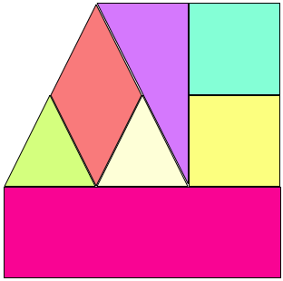

## Theory Questions

*  Your class `Derived` is derived from the class `Base`. You have hidden the member function `process(int)` from your base class (`Base::process(int)`) with the member function `process(float)` (`Derived::process(float)`). How can you make the hidden member function visible again in your derived class?

*  Given the following code:

```c++
struct Base {
  void function() const{}
};

struct Derived : Base {
  void function(){}
};

void call_function(Base b) {
  b.function();
}

int main() {
  Derived d{};
  call_function(d);
  Base b{};
  call_function(b);
}
```

What changes are required to the code above in order to have the member function **function()** of the type **Derived** called (in `void call_function(Base b)` for the statement `call_function(d);`)?

*  Explain what a pure virtual member function is. What are the implications of having one?

*  How can you store shapes (`shape` is the base class and can have derived classes like `square` and `diamond`, see exercise below) in a `std::vector` without producing memory leaks or object slicing?

<hr/>

## Understanding dynamic Polymorphism and Object lifetime

Please look at the following code and guess the output the main function generates. Do this, before you compile and run the code, because you might get a similar question in the exam where you can not just run the program. First check your result against the result of your neighbour then check your theoretical assumptions with the real output generated. If there are any discrepancies, can you explain them?

Header file: `inheritance.hpp`
```c++
#ifndef INHERITANCE_HPP
#define INHERITANCE_HPP

#include <iostream>

struct monster {
  monster() { std::cout << "a monster is bread\n"; }
  ~monster() { std::cout << "monster killed\n"; }
  auto health() -> void { std::cout << "immortal?\n"; }
  virtual auto attack() -> void { std::cout << "roar\n"; }
};

struct troll : monster {
  troll() { std::cout << "a troll grows\n"; }
  ~troll() { std::cout << "troll petrified\n"; }
  auto attack() -> void { swing_club(); }
  virtual auto swing_club() -> void {
    std::cout << "clubbing kills me\n";
    myhealth--;
  }
  void health() { std::cout << "troll-health:" << myhealth << '\n'; }

protected:
  int myhealth{10};
};

struct forum_troll : troll {
  forum_troll() : troll{} { std::cout << "not quite a monster\n"; }
  ~forum_troll() { std::cout << "troll banned\n"; }
   auto swing_club() -> void {
    std::cout << "swinging is healthy\n";
    myhealth++;
  }
  void attack() { std::cout << "write stupid things\n"; }
};

#endif
```

`main.cpp`

```c++
#include "inheritance.hpp"

auto main() -> int {
  std::cout << "a ------\n";
  forum_troll ft{};
  troll t{ft};
  monster &m{ft};
  std::cout << "b ------\n";
  ft.attack();
  t.attack();
  m.attack();
  std::cout << "c ------\n";
  ft.swing_club();
  t.swing_club();
  std::cout << "d ------\n";
  ft.health();
  t.health();
  m.health();
  std::cout << "end ------\n";
}
```

*  Considering what you have learned in C++ and Software Engineering, what bad practices does the above code contain? Try to find as many as possible and give yourself a short reason why that code is bad and how it could be improved.

## Algorithm Trivia

By now you should have solved almost all of the algorithm tivia examples... No? Time to continue then. There is not much time left.

<hr/>


## Support landscape architects' garden planning

The landscape architects Andrea and Melanie plan gardens with beds of geometric shape. They want to use squares, rectangles, diamonds, triangles. To lay out their garden beds they use pegs and string or rope to mark the bed's shape on the ground. Per bed they need string of the length of the shape's circumference and pegs for the corners of the shape. For each bed they also need seeds. Per square meter 100g seeds are used.

A possible garden bed arrangement with 3 triangles, a diamond, 2 squares and a rectangle may look like the following diagram:



Write a program that supports the landscape architect's work and that creates a shopping lists giving the number of pegs, the length of string and the amount of seeds to buy. 

Represent each bed by a class for its geometric shape. Figure out, which parameters the individual shape classes' constructors require. All lengths should be given in meters, all angles in radian (360 degrees = 2 * PI radian), because the trigonometric functions in `<cmath>` require that(`double const PI = 4.0 * atan(1.0);`). For the shopping list the positions of the individual beds are unimportant, so you do not need to represent that.

Create a library project consisting of your classes for all shapes, a CUTE library test project, that checks and demonstrates the features of the classes. You further need a function that fills a vector of shapes with all information for a garden and one function that creates a shopping list from that list. The shopping list consists of each bed with of the number of pegs, the length of string and the weight of the seeds to purchase and a sum of each of these things to purchase in the end (pegs, string, and seeds).

Demonstrate your code with a main program that creates a shopping list for the following garden beds:
*  a triangle with sides of length: 3, 6, 6.70820393
*  two triangles with sides of length: 3,4,4 
*  a diamond with the sides of length: 4 and an angle of 60 degrees
*  two squares with length 3
*  a rectangle with sides 4, 9

The shopping list created from these things should be similar to the following list:

```
Triangle 3 15.7082 0.9
Triangle 3 11 0.556215
Triangle 3 11 0.556215
Diamond 4 16 1.38564
Square 4 12 0.9
Square 4 12 0.9
Rectangle 4 26 3.6
pegs needed: 25
seeds needed: 8.79807 kg
rope needed: 103.708 m
```

Tips:
*  think what an abstract base class should provide as an interface
*  call member functions: pegs(), ropes(), seeds() that deliver the required information for creating a bed of a given shape
*  you might need a member function name() to create the shopping list
*  you might want to define a print() member in the base class and an output operator based on that
*  start with a class for square and write unit tests for it.

### Optional Extension: Circles and Ellipses

Look at the following article in Wikipedia ([Ellipse](https://en.wikipedia.org/wiki/Ellipse#Pins-and-string_method)) in section "Pins and String method" or in german Wikipedia  how a gardener would create an elliptical garden bed.

You can not put pegs in the "corners" of a circle or an ellipse, but you can give the number of pegs to construct the given shape and the length of string required for the construction plus for marking the circumference of the circle or ellipse constructed.

Create CUTE test cases and a main program that can add also a circle with radius of 4 and an ellipse with the axis 3 and 5.

### Optional Variation: `std::variant<triangle,square,rectangle,diamond,circle,ellipse>`

Consider the number of elements is fixed and change all your inheriting classes to stand-alone value classes. 
This means, no-more virtual and no inheritance. Create a `shape` type that is an alias to a `std::variant<...>`that can contain either of your shape types above.

Create or adapt your cute tests to the new representation. 

* Can you obtain the same functionality as before?
* How much do your tests have to change?

### Optional Extension: Beds with Gravel

In addition to flower beds the landscape architects also want to plan for Zen-like gravel beds. To avoid that weeds grow, they need a plastic sheet of the given shape to be put under the gravel. For each gravel bed you need to calculate the area for the sheet as well as the amount of gravel needed (25 kg/m2). Because the plastic sheets must be ordered in rectangular shape you need to calculate the sheet area to be ordered separately. For example, for a triangle you need the base line times the height, i.e., twice the triangles area for the plastic sheet order.


### Optional Extension: File I/O

Add functionality to read in lists of shape type and arguments from a file stream (gardenplan.txt) and to produce a shopping list in a file (shoppinglist.txt)

The format of the input file might look like:
```
Triangle 3.0 4.0 4.0
Square   5.0
Rectangle 3 4.0
Diamond 3.0 4.0 45.0
```
There is one shape per line and the first part of the line names the shape.

Tipp: write a factory function that creates a shape from such a text line plus a second factory function reading the whole file. For tests it is good to use istream& parameters for these function and only open file-streams in main.

It might be a good idea to create constructors for your concrete classes who can read their numerical parameters from an istream &.
Each shape class might need to read a different number of values from the stream. How can you handle input errors?
 
### Optional Extension: Arbitrary Polygons (very hard)

Extend your garden planning software with arbitrary regular polygon shapes, such as a pentagon or hexagon. Can you also represent trapezoids?
What about arbitrary convex polygons.

### Optional Extension: Position in the garden (extremly hard)

(Solving this extension requires algorithms for computational geometry.)

Represent not only the size but also the location of the garden beds, e.g., by representing the coordinates of the center or of the corners. Check if garden beds would overlap (start out with either circular (distance of centers > sum of radiuses) or rectangular beds). Start out with a rectangular garden. All planned flower beds must fit into the rectangle. You might want to assume a rectangular outer shape for the flower beds that aren't rectangles, like you did for the plastic sheet for gravel beds. 
